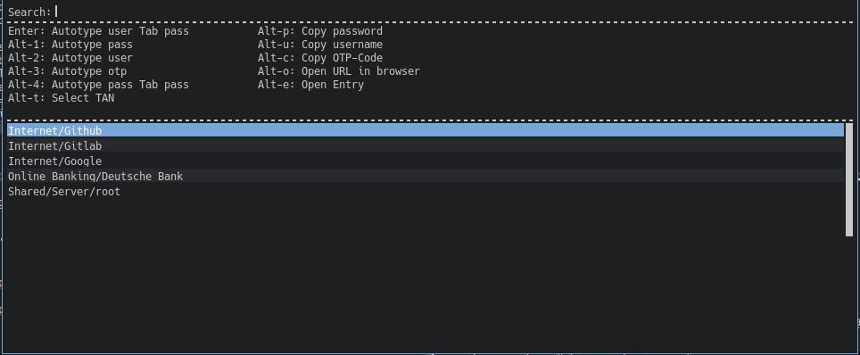

# autopass.cr

A rofi frontend for [pass](https://www.passwordstore.org)



This is a complete rewrite of [repomaa/autopass](https://gitlab.com/repomaa/autopass) with a focus
on maintainability, stability and safety. It's mostly backwards compatible
although you should remove your cache (`$XDG_CACHE_DIR/autopass/cache.gpg`) and
let autopass.cr rebuild it.

autopass.cr doesn't shell out for gpg, xclip or autotyping over xdotool but
instead uses native libraries.

## Features

- performs autotype with entries
- allows setting window name property (a regex) to match against window titles
- automatically focuses correct window or asks you to
- allows any amount of additional properties which can be used in autotype
- displays entries that are most likely to match currently focused window first
- uses encrypted cache to store pass entries in a single file for fast startup
- OTP (one-time-password) generation

## Installation

### ArchLinux

Be sure to import my GPG key:

[`CC7B D43A 315E BC37 3F9A 1F2E EFEB 16CB 1C89 52C5`](https://keys.openpgp.org/vks/v1/by-fingerprint/CC7BD43A315EBC373F9A1F2EEFEB16CB1C8952C5)

Get one of the following AUR packages:

- https://aur.archlinux.org/autopass.cr-bin
- https://aur.archlinux.org/autopass.cr
- https://aur.archlinux.org/autopass.cr-git

### Other systems

Install the following make dependencies:

- [crystal](https://crystal-lang.org/install/)
- shards (usually bundled with crystal)
- [rust](https://www.rust-lang.org/tools/install)
- cargo (usually bundled with rust)
- [git](https://git-scm.com/downloads)
- [python](https://www.python.org/downloads/)

Install the following runtime dependencies:

- [gpgme](https://www.gnupg.org/download/index.html)
- [rofi](https://github.com/davatorium/rofi/blob/next/INSTALL.md)
- [xdotool](https://www.semicomplete.com/projects/xdotool/)
- [gc](https://www.hboehm.info/gc/)
- [libyaml](https://pyyaml.org/wiki/LibYAML)
- [libevent](https://libevent.org/)

run `make install`

Optionally you can install one of the following browser extensions for better autotype. These add your current URL to
your title (and window title) which can be matched by the URL entry in your password entry.
- Chrom(e|ium) extension [url-in-title](https://chrome.google.com/webstore/detail/url-in-title/ignpacbgnbnkaiooknalneoeladjnfgb)
- Firefox extension [add-url-to-window-title](https://addons.mozilla.org/en-US/firefox/addon/add-url-to-window-title/) ([Repository](https://github.com/erichgoldman/add-url-to-window-title))

## Usage

- run `autopass`. It will take a while to fill the cache if you have a lot of
  entries.
- Highlight an entry either by fuzzy search or with arrow keys
- Press Enter for autotype (default: user TAB pass)
- Press Alt+1 for autotype_1 (default: pass)
- Press Alt+2 for autotype_2 (default: user)
- Press Alt+3 for autotype_3 (default: otp)
- etc
- Press Alt+p to copy pass to clipboard
- Press Alt+u to copy user to clipboard
- Press Alt+c to copy otp code to clipboard
- Press Alt+t to autotype a tan from the entry
- Press Alt+o to open specified URL in your browser
- Press Alt+e to open the selected entry

Copied values are cleared from clipboard after 10 seconds (previous clipboard
content is restored)

## Entry syntax

Create entries as usual with `pass insert` etc.
Edit them with `pass edit` and add additional properties in the following syntax

``` yaml
my_super_secret_password
---
user: username
url: https://example.com/login
some_other_property: some value
autotype: [user, ':tab', some_other_property, ':tab', pass, ':tab', ':otp']
autotype_1: [user]
autotype_2: [pass]
autotype_3: user some_other_property :tab pass # this is also ok
window: some site.*- Chromium
otp_secret: my_one_time_password_secret
tan: |
    204194
    294922
    240581
# ...
```

You can write any kind of key value pairs here as long as it's valid
[yaml](https://yaml.org).  The
keys `autotype`, `autotype_{1-7}`, `window`, `otp_secret` and `tan` have special
meanings. `':tab'` hits - you guessed it - the Tab key, `':enter'` hits the
Enter key, `':otp'` types the current time based one time password, `:delay`
delays the autotype sequence.  Make sure you add `otp_secret` to an entry when
using `':otp'`.

### Config:

autopass.cr looks for a config file `$XDG_CONFIG_HOME/autopass/config.yml`. To
get started, run `autopass config` to print out a config with all values set to
the defaults.

You can override the default behavior of `autotype_1` and `autotype_2` for
example to be reversed: `autotype_1: [user]`, `autotype_2: [pass]`.

Furthermore you can set keys to use for looking up the custom autotype sequence
`autotype_key: autotype`, username `username_key: user` and password
`password_key: pass` in the config file.

Some users experience problems with alternative autotypes (using the Alt
modifier key). It almost certanly is caused by releasing the Alt key only after
the autotype has already started. Therefor there's a config option
`alt_delay` which waits the amount in seconds before starting the autotype for
alternative autotypes.

### Socket activation

autopass.cr supports systemd socket activation. This allows the program to keep
running in the background with the decrypted cache and last state (e.g. last
open entry) in ram so starting up and restoring the state is much faster.

You can find examples for socket and service units in
[autopass.socket](https://gitlab.com/repomaa/autopass.cr/tree/master/autopass.socket) and
[autopass.service](https://gitlab.com/repomaa/autopass.cr/tree/master/autopass.service).

If you installed autopass.cr from AUR, socket and service files have been set up
for you. Start the socket by running `systemctl --user start autopass.socket`.
This will open a FIFO `$XDG_RUNTIME_DIR/autopass.fifo`. To start autopass simply
write anything followed by newline on the FIFO: `echo start >>
$XDG_RUNTIME_DIR/autopass.fifo`.

autopass will keep running in the background for 15 minutes by default. You can
adjust this value with the option `server_timeout`. Here are some examples for
possible values for the setting:

- `1.hour`
- `30.seconds`
- `5.days`
- `20` (values without units are treated as minutes)

## Contributing

1. Fork it (<https://github.com/repomaa/autopass/fork>)
2. Create your feature branch (`git checkout -b my-new-feature`)
3. Commit your changes (`git commit -am 'Add some feature'`)
4. Push to the branch (`git push origin my-new-feature`)
5. Create a new Pull Request

## Contributors

- [repomaa](https://github.com/repomaa) Joakim Repomaa - creator, maintainer
